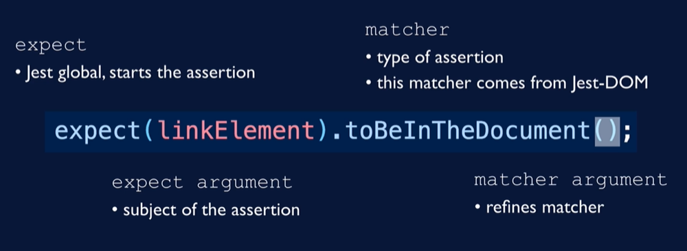

#React testing

Unit tests: test one unit of code in isolation. 
Mock dependencies, test internals. Very easy to pinpoint failures, but further
from how users interact with software. More likely to break with refactoring.

Integration tests: test how multiple units work together. 

Functional tests: test a particular behavior of software. E.g. enter data into 
a form and click submit. Close to how users interact with software, robust tests.
However, more difficult to debug failing tests.

Acceptance / End-to-end (E2E) tests: use actual browser and server. Require
a special tool (Cypress, Selenium).

React testing library creates a virtual DOM for us and allows us to interact
with that DOM. React testing library encourages functional tests.

Testing library encourages testing behavior over implementation.

Testing library recommends finding elements by accessibility queries.
https://testing-library.com/docs/queries/about/#priority

If you cannot find an element like a screen reader would, then your app is not
friendly to screen readers.

Do unit tests if
* Complex logic difficult to test via functional tests
* Too many edge cases